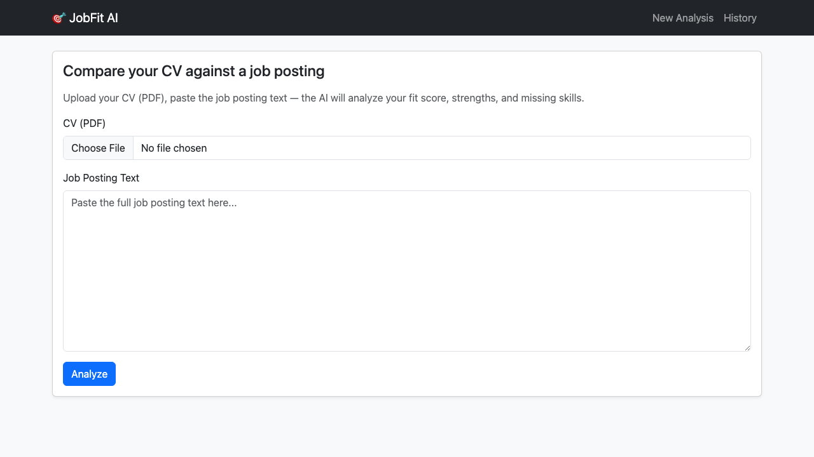
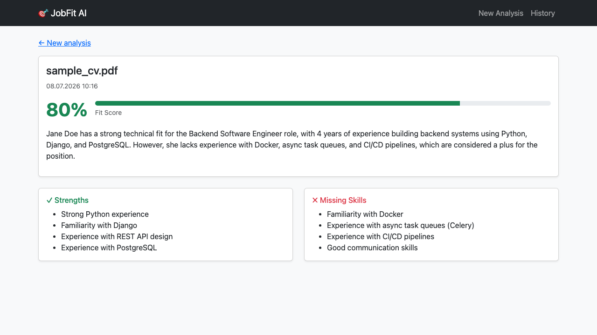
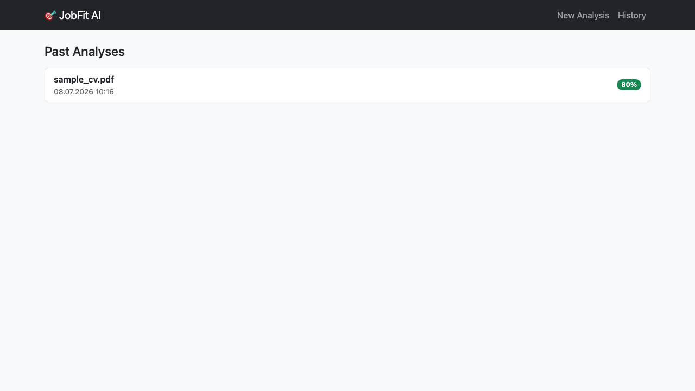

# JobFit AI

Upload your CV (PDF) and a job posting's text — an LLM (Llama 3.3 70B via Groq) compares the two and produces a structured fit report (0-100 score, strengths, missing skills, short summary).

**Live demo:** [jobfit-ai-0n3m.onrender.com](https://jobfit-ai-0n3m.onrender.com) — upload any CV PDF and paste a job posting to try it. (The free Render plan spins down when idle, so the first request may take ~30-50 seconds.)

## How it works

1. Upload your CV as a PDF, paste the full job posting text.
2. `pypdf` extracts the text from the PDF in memory (the file itself is never written to disk/database).
3. The extracted text + job description are sent to the model via **tool/function calling** — instead of free-form text, the model is forced to produce a structured response matching a defined schema (`match_score`, `strengths`, `missing_skills`, `summary`). This is far more reliable than asking for JSON in a prompt and parsing it with regex.
4. The result is saved to the database and can be revisited from the history page.

## Screenshots

**Upload** — submit your CV (PDF) and paste the job posting text


**Result** — fit score, strengths, and missing skills


**History** — revisit past analyses


## Tech Stack

- **Backend**: Django 4.2
- **PDF processing**: pypdf (in memory, file never written to disk)
- **AI**: Groq API (`llama-3.3-70b-versatile`, free tier, no credit card required), structured JSON output via tool calling
- **UI**: Bootstrap 5 (CDN)
- **Database**: SQLite (both local development and production — see the Deployment section for why)

## Setup

```bash
git clone <this-repo>
cd jobfit-ai
python3 -m venv venv
source venv/bin/activate
pip install -r requirements.txt
cp .env.example .env
# open .env and replace GROQ_API_KEY with your own key
# (free key: https://console.groq.com/keys — no credit card required)
python manage.py migrate
python manage.py runserver
```

Visit `http://127.0.0.1:8000` and try it out with a CV PDF and a job posting.

## Tests

```bash
python manage.py test matcher
```

9 tests: PDF text extraction (with valid and corrupted files), form validation, the full analysis flow, score clamping (0-100), and the result/history pages. The model API is **never actually called during tests** — `analyze_fit` is mocked, so the tests run free, fast, and deterministic.

## Deployment

`render.yaml` defines a [Render](https://render.com) Blueprint with a single web service — no Postgres, no Redis/worker. Unlike OrderLens, no async queue is needed here since the Groq call is synchronous. `GROQ_API_KEY` isn't auto-generated (it's a secret), so you'll be prompted to enter it when applying the Blueprint.

**Why SQLite instead of Postgres:** Render's free plan allows only one free Postgres database per account, and that slot is already used by [OrderLens](https://github.com/alperensamilx/orderlens)'s `orderlens-db`. Rather than pay for a second database for a demo project, JobFit AI runs on SQLite. The trade-off: Render's free web dyno's disk isn't persistent across redeploys, so the analysis history table resets whenever new code is pushed. Each analysis itself still works correctly in the meantime — only old history rows are affected, not the CV/job-posting comparison itself. If this app needed durable history in production, the fix would be provisioning a real Postgres instance (paid, since the free tier is already spoken for).

## Why no Celery/async?

Unlike OrderLens (another one of my projects), this makes a single API call — a few seconds, not a heavy operation like pandas/matplotlib. So a synchronous request/response was deliberately kept simple; no unnecessary complexity was added.

## Project Structure

```
matcher/
  models.py        # Analysis model (cv_text, job_description, match_score, strengths, missing_skills, summary)
  pdf_utils.py      # PDF text extraction (in memory, with error handling)
  groq_client.py    # Groq API integration — structured output via tool calling
  views.py          # analyze / result / history views
  forms.py          # upload form (PDF extension/size validation)
  tests.py          # test suite with the API mocked out
  templates/        # Bootstrap-based templates
```

## License

MIT
